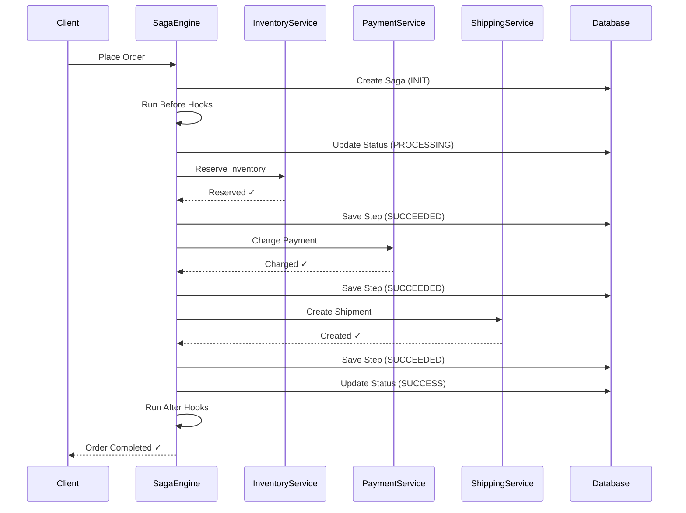
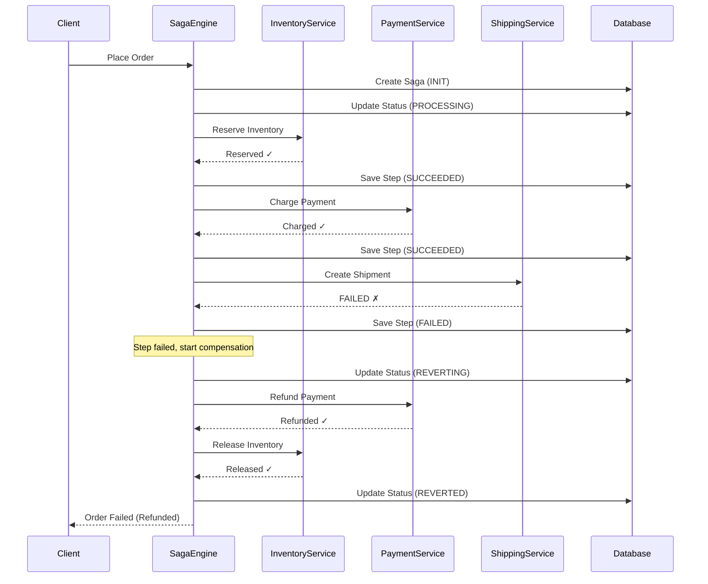

# Saga Pattern Explained

## What is a Saga?

A Saga is a sequence of local transactions where each transaction updates data within a single service. If one transaction fails, the saga executes compensating transactions to undo the changes made by preceding transactions.

## Why Sagas?

In distributed systems, we can't use traditional ACID transactions across services. Sagas provide:

1. **Eventual consistency**: Data becomes consistent after all steps complete
2. **Failure handling**: Compensation logic undoes partial changes
3. **Visibility**: Each step's state is tracked

## Saga Flow Example

```
E-commerce Order Saga:

[Reserve Inventory] → [Charge Payment] → [Create Shipment] → [Notify Customer]
         ↓                    ↓                   ↓
    (Compensate)        (Compensate)        (Compensate)
[Release Inventory] ← [Refund Payment] ← [Cancel Shipment]
```

## Sequence Diagram: Successful Flow



## Sequence Diagram: Failure and Compensation



## Step Result Handling

```java
return switch (result.getStatus()) {
    case SUCCEEDED -> {
        // Continue to next step or SUCCESS
        if (context.isLastStep()) {
            yield handleSuccess(context);
        }
        yield continueProcessing(context);
    }
    
    case FAILED -> {
        // Start compensation
        yield handleFailure(context);
    }
    
    case PENDING -> {
        // Wait for callback
        context.setStatus(PENDING);
        yield context;
    }
    
    case UNKNOWN -> {
        // Can't determine result, mark pending
        // Recovery job will query later
        yield handleUnknown(context);
    }
};
```

## Compensation Rules

### When to Compensate

| Scenario | Action |
|----------|--------|
| First step fails | No compensation (nothing succeeded) |
| Later step fails | Compensate all succeeded steps |
| Partial "add" success | Manual review (can't undo delivery) |

### Compensation Order

Compensate in **reverse order** of execution:

```
Execute: Step1 → Step2 → Step3
Compensate: Step3 → Step2 → Step1
```

Why reverse? Because later steps may depend on earlier ones.

## Idempotency

**Critical**: All saga steps MUST be idempotent.

Why? Because we might re-execute steps during:
- Recovery after crash
- Retry after timeout
- Resume after callback

Example:
```java
public StepResult doExecute() {
    // Check if already done
    if (paymentExists(orderId)) {
        return StepResult.completed(existingRefId);
    }
    
    // Execute with idempotency key
    return chargePayment(orderId, amount);
}
```

## Timeout Handling

```java
public class SagaContext {
    private Duration timeout = Duration.ofMinutes(30);
    
    public boolean isTimeout() {
        return Instant.now().isAfter(createdAt.plus(timeout));
    }
    
    public void extendTimeoutForCompensation() {
        // Ensure enough time for compensation
        if (getRemainingTime() < MIN_TIMEOUT_FOR_REVERT) {
            timeout = timeout.plus(MIN_TIMEOUT_FOR_REVERT);
        }
    }
}
```

## Recovery Job

A background job handles stuck sagas:

```java
@Scheduled(fixedRate = 60000)
public void recoverStuckSagas() {
    var stuckSagas = repository.findStuckSagas(
        List.of(PROCESSING, PENDING, REVERTING),
        olderThanMinutes: 5,
        limit: 100
    );
    
    for (var saga : stuckSagas) {
        sagaEngine.resume(ResumeSagaCommand.builder()
            .orderId(saga.getOrderId())
            .isRecovery(true)
            .build());
    }
}
```

## Best Practices

1. **Keep steps small**: Each step should do ONE thing
2. **Make steps idempotent**: Safe to retry
3. **Log everything**: Debugging distributed systems is hard
4. **Set appropriate timeouts**: Not too short, not too long
5. **Monitor stuck sagas**: Alert on PENDING states over threshold
6. **Test compensation**: Failure paths are often under-tested
