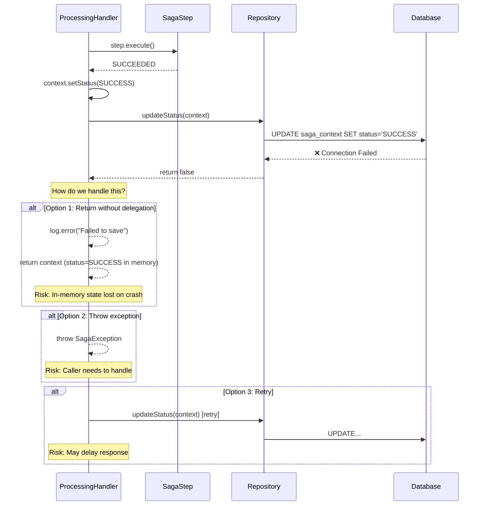
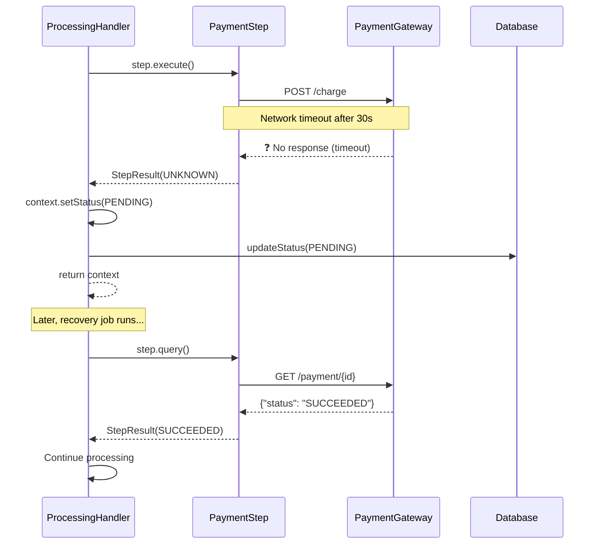
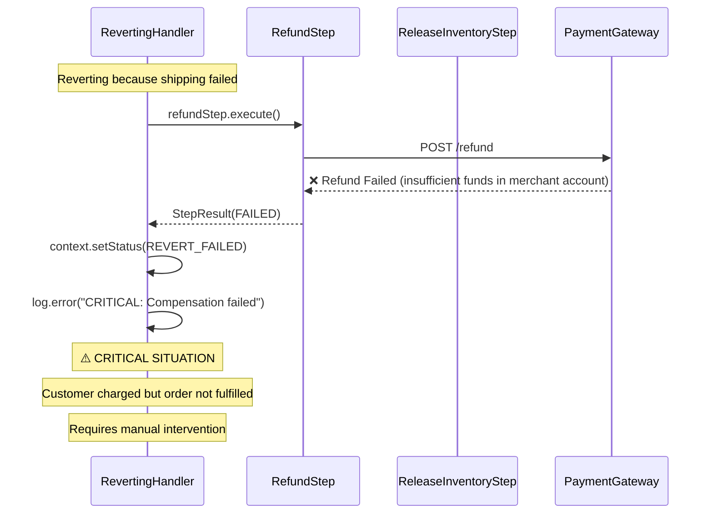
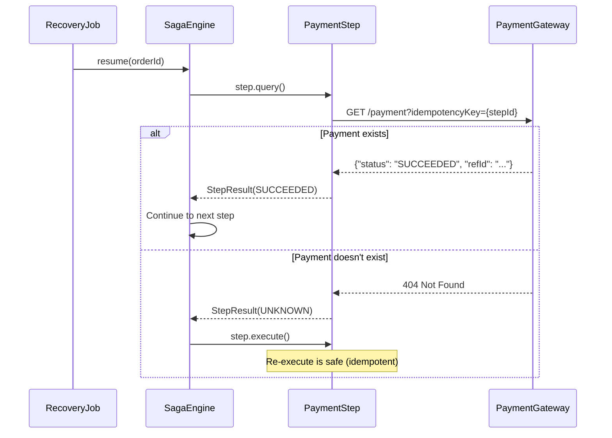

# Scenario Testing: Error Handling

This document explores how the saga handles various failure scenarios.

## Scenario 1: Database Failure During State Transition

**Question**: What happens if the database connection fails during `updateStatus()`?

### Sequence Diagram



### Current Implementation

```java
private SagaContext handleSuccess(SagaContext context) {
    context.setStatus(OrderStatus.SUCCESS);
    
    boolean saved = sagaRepository.updateStatus(context);
    if (!saved) {
        // Option 1: Log and continue
        log.error("[Processing] Failed to save SUCCESS status");
        // Context has correct status in memory
        // Recovery job will fix DB eventually
    }
    
    return stateContainer.getHandler(OrderStatus.SUCCESS).process(context);
}
```

### Why This Approach?

1. **Availability over Consistency**: We prefer the saga to continue
2. **Recovery Job**: Will detect and fix inconsistencies
3. **Idempotency**: Re-processing is safe

### Better Approach: Transactional Outbox

```java
@Transactional
public SagaContext handleSuccess(SagaContext context) {
    context.setStatus(OrderStatus.SUCCESS);
    
    // Both in same transaction
    sagaRepository.updateStatus(context);
    outboxRepository.save(new SagaCompletedEvent(context));
    
    // If either fails, both roll back
}
```

## Scenario 2: Step Returns UNKNOWN Status

**Question**: What if we can't determine if a step succeeded or failed?

### Sequence Diagram



### Implementation

```java
case UNKNOWN -> {
    log.warn("[Processing] Step {} UNKNOWN, marking PENDING", step.getStepId());
    
    // Don't know if succeeded or failed
    // Mark as PENDING so recovery job can query later
    context.setStatus(OrderStatus.PENDING);
    context.setLastResult(result);
    sagaRepository.updateStatus(context);
    
    yield context; // Don't continue, wait for recovery
}
```

### Recovery Job

```java
@Scheduled(fixedRate = 60000)
public void recoverPendingSagas() {
    var pendingSagas = repository.findByStatus(PENDING, olderThan: 5.minutes);
    
    for (var saga : pendingSagas) {
        var step = saga.getCurrentStep();
        
        // Query external system for actual status
        var result = step.query();
        
        if (result.getStatus() != UNKNOWN) {
            // Got a real answer, resume saga
            sagaEngine.resume(saga.getOrderId(), result);
        }
    }
}
```

## Scenario 3: Compensation Step Fails

**Question**: What if the refund fails during reverting?

### Sequence Diagram



### Implementation

```java
case FAILED, REJECTED -> {
    log.error("[Reverting] CRITICAL: Compensation FAILED for {}: {}", 
        step.getStepId(), result.getErrorMessage());
    
    // This is bad - we have inconsistent state
    context.setStatus(OrderStatus.REVERT_FAILED);
    context.setLastResult(result);
    sagaRepository.updateStatus(context);
    
    // Alert operations team
    alertService.sendCriticalAlert(
        "Saga compensation failed",
        context.getOrderId(),
        step.getStepId()
    );
    
    // Create support ticket
    supportService.createTicket(
        "Manual intervention required",
        context
    );
    
    yield context;
}
```

### Mitigation Strategies

1. **Retry with backoff**: Try compensation multiple times
2. **Alert immediately**: Don't let it go unnoticed
3. **Manual intervention workflow**: Clear process for ops team
4. **Financial reconciliation**: Daily check for mismatches

## Scenario 4: System Crash Mid-Processing

**Question**: What if the system crashes between step execution and status save?

### Timeline

```
T0: Step executes (charges customer $100)
T1: System crashes before saving SUCCEEDED status
T2: System restarts
T3: Recovery job finds saga in PROCESSING state
T4: ??? What happens to the $100 charge?
```

### Solution: Idempotency Keys

```java
public class PaymentSagaStep extends AbstractSagaStep {
    
    @Override
    protected StepResult doExecute() {
        // Use order ID + step ID as idempotency key
        String idempotencyKey = stepId;
        
        // Check if already processed
        var existing = paymentClient.findByIdempotencyKey(idempotencyKey);
        if (existing.isPresent()) {
            return StepResult.completed(existing.get().getRefId());
        }
        
        // Execute with idempotency key
        var response = paymentClient.charge(ChargeRequest.builder()
            .idempotencyKey(idempotencyKey)
            .amount(amount)
            .build());
        
        return StepResult.success(response.getRefId());
    }
}
```

### Recovery Flow



## Scenario 5: Concurrent Updates

**Question**: What if two processes try to update the same saga?

### Problem

```
Process A: Reading saga (status=PROCESSING)
Process B: Reading saga (status=PROCESSING)
Process A: Update to SUCCESS
Process B: Update to REVERTING
Process B: Overwrites A's update! ❌
```

### Solution: Optimistic Locking

```java
// Repository implementation
public boolean updateStatus(SagaContext context) {
    int updated = jdbcTemplate.update("""
        UPDATE saga_context 
        SET status = ?, updated_at = NOW()
        WHERE order_id = ? 
        AND updated_at = ?  -- Optimistic lock
        """,
        context.getStatus().name(),
        context.getOrderId(),
        context.getUpdatedAt()  // Must match what we read
    );
    
    if (updated == 0) {
        log.warn("Optimistic lock failed - saga was modified by another process");
        return false;
    }
    return true;
}
```

### Alternative: Distributed Lock

```java
public SagaContext process(SagaContext context) {
    String lockKey = "saga:" + context.getOrderId();
    
    try (var lock = redisLock.acquire(lockKey, timeout: 30.seconds)) {
        // Only one process can be here
        return doProcess(context);
    } catch (LockNotAcquiredException e) {
        log.warn("Could not acquire lock, saga being processed by another instance");
        return context;
    }
}
```

## Summary

| Scenario | Risk | Mitigation |
|----------|------|------------|
| DB failure on save | Lost state update | Recovery job, outbox pattern |
| UNKNOWN step result | Stuck saga | Recovery job queries external system |
| Compensation fails | Inconsistent state | Alert, manual intervention |
| Crash mid-processing | Duplicate execution | Idempotency keys |
| Concurrent updates | Lost updates | Optimistic locking |
