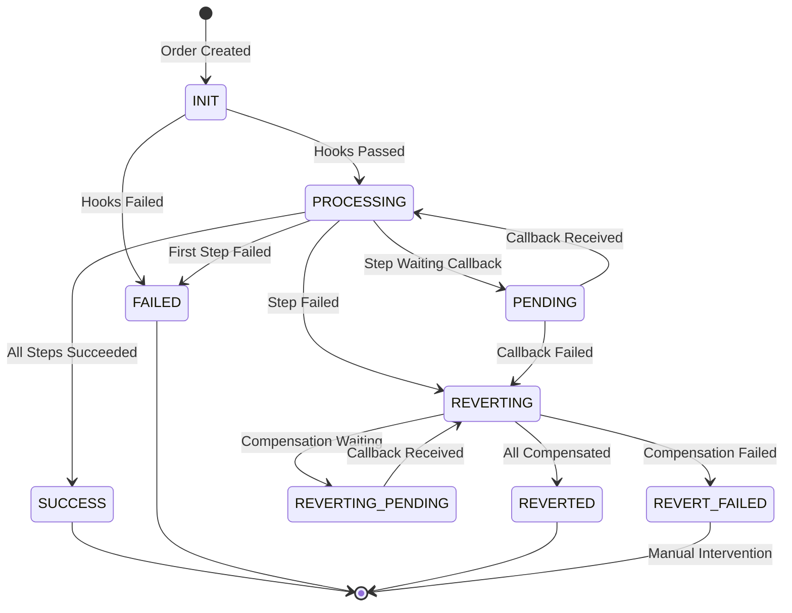

# State Machine Deep Dive

## Overview

The State Machine pattern is central to managing saga lifecycle. It ensures:
- **Predictable transitions**: Only valid state changes occur
- **Audit trail**: Every state change is trackable
- **Recovery**: System can resume from any state

## State Diagram



## State Handlers

Each state has a dedicated handler:

| State | Handler | Responsibility |
|-------|---------|----------------|
| INIT | InitStateHandler | Run before hooks, validate, start |
| PROCESSING | ProcessingStateHandler | Execute forward steps |
| PENDING | ProcessingStateHandler | Wait for callbacks |
| REVERTING | RevertingStateHandler | Execute compensation steps |
| SUCCESS/FAILED/etc | TerminalStateHandler | Cleanup, notifications |

## Handler Implementation Pattern

```java
@StateService(states = {OrderStatus.PROCESSING})
public class ProcessingStateHandler implements StateHandler {
    
    @Override
    public SagaContext process(SagaContext context) {
        // 1. Get next step
        var step = context.getNextStep();
        
        // 2. Execute step
        var result = step.execute();
        
        // 3. Handle result (switch expression)
        return switch (result.getStatus()) {
            case SUCCEEDED -> handleSuccess(context);
            case FAILED -> handleFailure(context);
            case PENDING -> handlePending(context);
            // ...
        };
    }
    
    private SagaContext handleSuccess(SagaContext context) {
        if (context.isLastStep()) {
            context.setStatus(OrderStatus.SUCCESS);
            // Delegate to SUCCESS handler
            return container.getHandler(SUCCESS).process(context);
        }
        // Continue processing
        return container.getHandler(PROCESSING).process(context);
    }
}
```

## Key Design Decisions

### 1. @StateService Annotation

```java
@StateService(states = {OrderStatus.PROCESSING, OrderStatus.PENDING})
```

**Why**: 
- Declarative registration (not imperative)
- Compile-time safety
- Self-documenting code

### 2. Handler Delegation

```java
return container.getHandler(nextStatus).process(context);
```

**Why**:
- Handlers don't know about each other
- Easy to add new states/handlers
- Clear flow through state machine

### 3. Single Responsibility

Each handler manages ONE state (or closely related states).

**Why**:
- Easier to test
- Easier to understand
- Changes isolated to single handler

## State Transition Rules

### Forward Flow
```
INIT → PROCESSING → SUCCESS
                  → PENDING → PROCESSING (loop)
                  → REVERTING
                  → FAILED (first step fails)
```

### Compensation Flow
```
REVERTING → REVERTED
          → REVERTING_PENDING → REVERTING (loop)
          → REVERT_FAILED
```

### Recovery Flow
```
PROCESSING → RESUMING_PROCESSING → PROCESSING
REVERTING → RESUMING_REVERTING → REVERTING
```

## Thread Safety

The state machine is thread-safe by design:

1. **Context per request**: Each saga gets its own SagaContext
2. **Handlers are stateless**: No instance variables modified
3. **Repository handles concurrency**: Optimistic locking on updates

## Database Schema

```sql
CREATE TABLE saga_context (
    order_id BIGINT PRIMARY KEY,
    order_no VARCHAR(100) UNIQUE,
    status VARCHAR(50) NOT NULL,
    customer_id BIGINT,
    timeout_ms BIGINT DEFAULT 1800000,
    created_at TIMESTAMP DEFAULT CURRENT_TIMESTAMP,
    updated_at TIMESTAMP DEFAULT CURRENT_TIMESTAMP,
    metadata JSON,
    INDEX idx_status (status),
    INDEX idx_updated (updated_at)
);

CREATE TABLE saga_step (
    step_id VARCHAR(100) PRIMARY KEY,
    order_id BIGINT NOT NULL,
    step_index INT NOT NULL,
    action VARCHAR(50) NOT NULL,
    status VARCHAR(50) NOT NULL,
    error_code INT,
    error_message TEXT,
    external_ref_id VARCHAR(100),
    created_at TIMESTAMP DEFAULT CURRENT_TIMESTAMP,
    updated_at TIMESTAMP DEFAULT CURRENT_TIMESTAMP,
    FOREIGN KEY (order_id) REFERENCES saga_context(order_id),
    INDEX idx_order (order_id)
);
```
